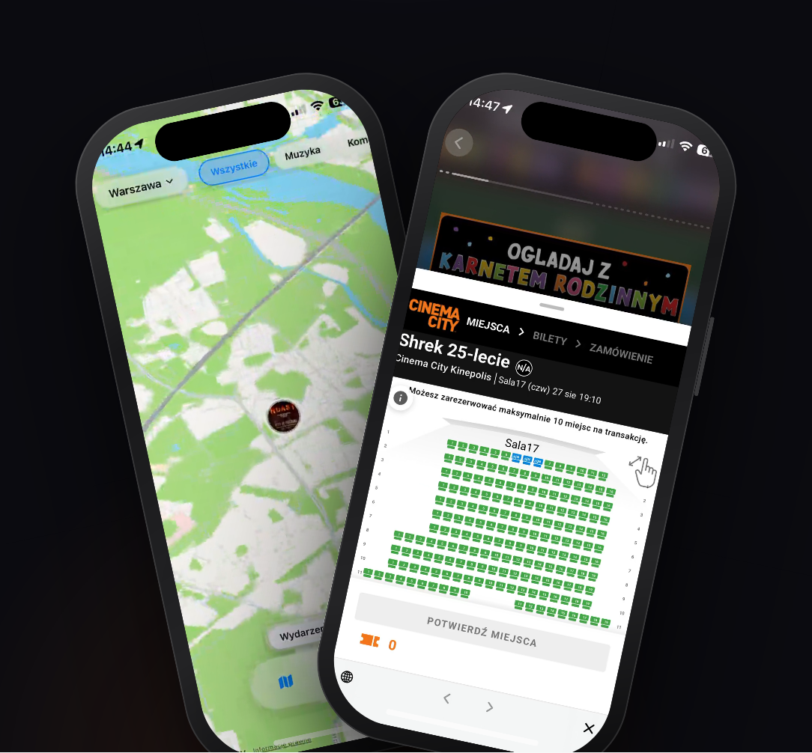

  

<h1 align="center">Pan Peryskop</h1>

  <strong>Mobile APP · Events · LIVE</strong> 
  See what's happening in your city 
  geo-anchored stories (photo, video) and events
   
   
  

---

  

## Stack

- **iOS:** SwiftUI, iOS 18+ (XcodeGen project)
- **Map:** MapLibre Native + OSM
- **Backend:** Cloudflare Workers (Hono) + D1 + R2 + Queues
- **Auth:** Sign in with Apple, per-device bans
- **Website:** Cloudflare Pages landing
